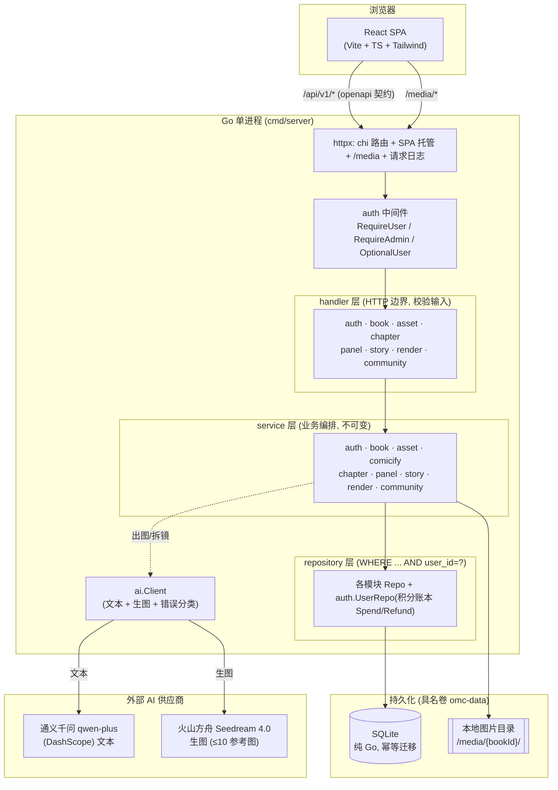
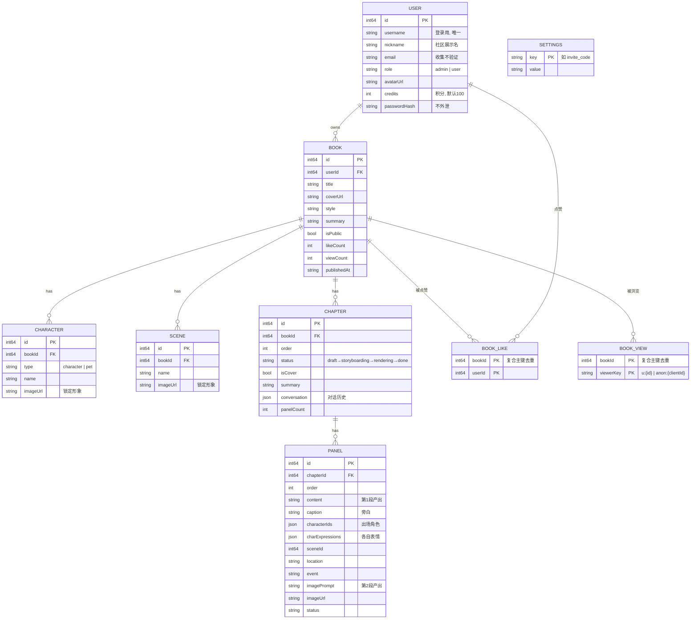
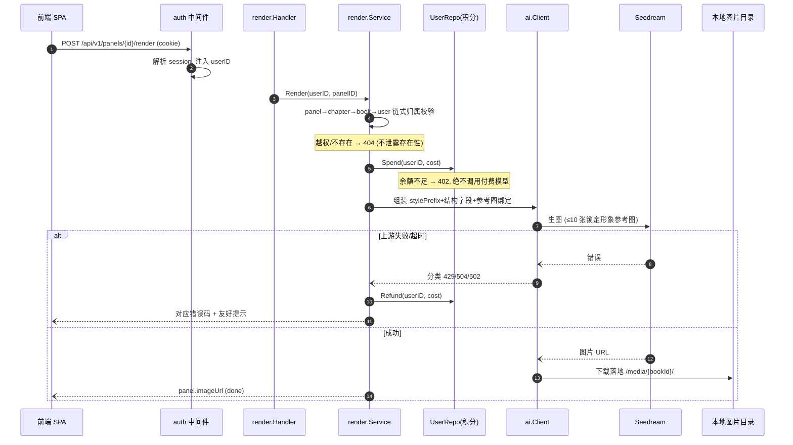
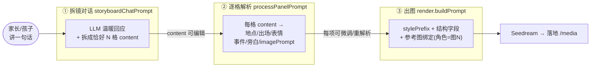
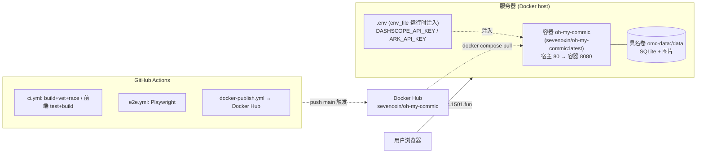

# oh-my-commic 系统设计与架构

> 本文是 **系统设计与架构的权威入口**：设计目标、架构图、数据模型、核心流程、部署拓扑，以及全部分功能设计文档的索引。
> 提示词原文与细粒度模块/文件地图见 [`ARCHITECTURE-AND-PROMPTS.md`](ARCHITECTURE-AND-PROMPTS.md)；API 契约见 [`openapi.yaml`](openapi.yaml)。

---

## 1. 是什么 / 设计目标

面向小朋友 & 亲子的 **AI 漫画书**：上传家人/宠物照片 → AI 漫画化成**锁定形象** → 对话式拆镜 → 逐格出图 → 拼成可翻页绘本 → 发布到社区。

设计上有四条贯穿始终的原则：

1. **多用户隔离是第一要务**：每个数据访问都能追溯并校验 `user_id`；跨用户/不存在一律 **404**（不泄露存在性）。
2. **不可变**：service 返回新对象，不原地改入参。
3. **小文件、单一职责**：17 个领域模块，模块间只经公开接口交互（构造注入）。
4. **契约驱动**：前后端以 `openapi.yaml` 为单一真相，契约测试对每个响应校验，防漂移。

---

## 2. 系统架构（分层 + 外部依赖）

**要点**：单进程同时托管 SPA + API + 图片；`auth.UserRepo` 用一个窄接口 `Spend/Refund` 充当积分账本，被 `render`/`comicify` 依赖（接口隔离）；所有 AI 调用集中在 `ai.Client`，上游错误在此分类为 429/504/502，**绝不外泄 body 与 key**。

---

## 3. 数据模型（ER 图）

- **一本书 = 一个宇宙**：`Book` 顶层单元，自带 `Character/Scene` 库跨章复用。
- **社区两表**：`book_likes`、`book_views` 均用**复合主键去重**；feed 索引 `idx_books_public_published`。
- **全局邀请码**存 `settings` 表、可轮换。

---

## 4. 核心流程时序（以"逐格出图"为例）

展示隔离校验、积分预扣/退还、参考图锁一致性如何串起来：

---

## 5. 两段式提示词编排（核心 AI 设计）

把"一句话 → 可出图的画面"拆成**内容 / 结构 / 出图**三个**可干预**阶段——这也是产品"把 agent 从黑盒变玻璃盒"的技术基础：

拆两段的收益：单次 LLM 负担更小、更不易截断成非法 JSON；每格可**独立重试**；中间态**摊开可编辑**。提示词原文见 [`ARCHITECTURE-AND-PROMPTS.md` §3](ARCHITECTURE-AND-PROMPTS.md)。

---

## 6. 部署拓扑

**密钥只在 `.env`（`env_file` 运行时注入），绝不进镜像、绝不入 git**；数据落具名卷；健康探针 `/api/health` + `restart: unless-stopped`。部署与升级步骤见 [README「🐳 Docker 部署」](../README.md#-docker-部署)。

---

## 7. 模块边界与依赖

17 个领域模块，每个只暴露 `NewRepo / NewService / NewHandler`，模块间**只依赖对方 service 接口**，在 `cmd/server/main.go` 用构造注入装配。完整模块表（职责边界 / 对外暴露 / 消费谁的接口）见 [交付说明 DELIVERABLE.md 第二部分 §1.1](DELIVERABLE.md)，细粒度文件地图见 [ARCHITECTURE-AND-PROMPTS.md §2](ARCHITECTURE-AND-PROMPTS.md)。

---

## 8. 设计文档索引（分功能 spec）

系统是**分功能迭代**的，每个功能有独立设计文档（`docs/superpowers/specs/`）与实施计划（`docs/superpowers/plans/`）：

| 功能 | 设计文档 |
|---|---|
| 初版整体设计（骨架） | [`2026-08-07-oh-my-commic-design.md`](superpowers/specs/2026-08-07-oh-my-commic-design.md) |
| 对话式拆镜 | [`2026-08-07-conversational-storyboard-design.md`](superpowers/specs/2026-08-07-conversational-storyboard-design.md) |
| 两段式分镜 | [`2026-08-08-two-stage-storyboard-design.md`](superpowers/specs/2026-08-08-two-stage-storyboard-design.md) |
| 出图阶段改进 | [`2026-08-08-render-stage-improve-design.md`](superpowers/specs/2026-08-08-render-stage-improve-design.md) |
| 书封面 | [`2026-08-08-book-cover-design.md`](superpowers/specs/2026-08-08-book-cover-design.md) |
| 阅读器 | [`2026-08-08-book-reader-design.md`](superpowers/specs/2026-08-08-book-reader-design.md) |
| 用户管理（邀请码/角色/积分） | [`2026-08-08-user-management-design.md`](superpowers/specs/2026-08-08-user-management-design.md) |
| 社区（公开只读 + 点赞/浏览） | [`2026-08-08-community-design.md`](superpowers/specs/2026-08-08-community-design.md) |
| 社区应用壳（左栏 tab + 内容区） | [`2026-08-08-community-shell-design.md`](superpowers/specs/2026-08-08-community-shell-design.md) |

---

## 9. 相关文档

- [`README.md`](../README.md) — 快速开始 / Docker 部署 / 环境变量
- [`DELIVERABLE.md`](DELIVERABLE.md) — 按评审维度的交付说明（五部分）
- [`USAGE.md`](USAGE.md) — 图文使用教程
- [`ARCHITECTURE-AND-PROMPTS.md`](ARCHITECTURE-AND-PROMPTS.md) — 模块/文件地图 + AI 提示词原文
- [`openapi.yaml`](openapi.yaml) — API 契约（单一真相）
- `CLAUDE.md` — 迭代上手指南 + 核心约定 + 踩过的坑
