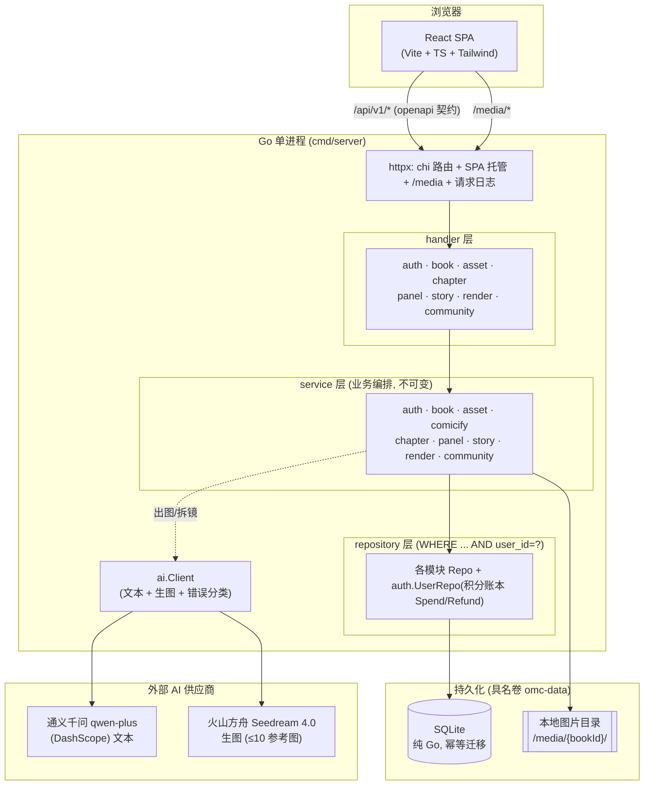

# oh-my-commic 交付说明

> 面向小朋友 & 亲子的 **AI 漫画书**制作 Web 应用。48 小时面试作品。
> 本文按笔试评审维度组织，逐条给出可复核的证据（代码路径 / 端点 / 测试）。

**在线可访问**：<http://commic.1501.fun/>（Docker 已部署，容器 healthy）。
本地一键跑通见 [README「快速开始」](../README.md#-快速开始)，图文用法见 [USAGE](USAGE.md)。

---

## 第一部分：功能完整性、稳定性与基本工程质量

### 1. 一句话结论

这不是一个只跑通"Hello World"的原型，而是一个**端到端闭环、多用户隔离、已上线可访问**的完整 demo 产品：
从注册登录 → 建书 → 上传真人照 AI 漫画化成固定角色 → 对话式拆镜 → 逐格 AI 出图 → 拼成可翻页绘本 → 发布到社区供匿名访客浏览点赞，**每一步都真实可用**，且由 **299 个 Go 测试 + 60 个前端用例 + 3 条 E2E + 契约校验 + 三条 CI 流水线**兜底。

---

### 2. 功能完整性

#### 2.1 端到端主流程（已全线打通）

```
注册(邀请码闸门) → 登录 → 新建书
   → 建演员表：上传真人照 → AI 漫画化成锁定形象（角色/宠物/场景）
   → 讲故事：对话式拆镜（第1段产出分镜内容）
   → 逐格解析（第2段产出结构化设定 + 出图提示词）
   → 逐格出图（Seedream，参考图锁一致性）
   → 拼版成书 → 翻页阅读
   → 一键发布到社区 → 匿名访客浏览 / 点赞 / 计浏览量
```

主流程的每一环都有对应的**真实端点 + 前端页面 + 测试**，不是占位。完整端点契约见 [`docs/openapi.yaml`](openapi.yaml)（OpenAPI 3.1，40+ 端点）。

#### 2.2 分模块功能清单

| 领域 | 支持的功能 | 后端模块 |
|---|---|---|
| **账户 / 权限** | 用户名登录、持久化 session、注册走**邀请码闸门**、`role∈{admin,user}`、启动播种管理员、管理员可查看/轮换邀请码、积分体系（默认 100，出图/漫画化各扣 1、失败退还）、个人资料（昵称/年龄/性别/头像上传） | `auth` |
| **书 / 资产** | 书 CRUD（封面、风格、简介）、角色/宠物/场景 CRUD、上传图 AI **漫画化成锁定形象**、形象**重新生成**（对当前锁定图再画，不留原图） | `book` `asset` `comicify` |
| **对话拆镜** | 两段式：第 1 段对话拆镜产出 content-only 分镜、支持"恰好 N 格"（4/6/8）、逐格文字可编辑；第 2 段 `process` 从 content 解析出地点/出场角色/表情/场景/事件/旁白/出图提示词 | `story` `chapter` `panel` `ai` |
| **逐格出图** | 单格同步出图（吉卜力风、无边框）、多参考图显式绑定锁一致性、"全部生成"并发出图、单格重画 | `render` `ai` `imageutil` |
| **拼书阅读** | 章节状态机 `draft→storyboarding→rendering→done`、封面章、拼版成页、翻页阅读器（私有/公开共用展示层） | `chapter` `book` |
| **社区** | 公开 feed（最新/最热排序）、精选、全屏公开阅读（**匿名可看**）、点赞去重、独立访客浏览计数、owner 一键发布/下架 | `community` `book` |
| **平台 / 托管** | 单进程同时托管 SPA + API + `/media` 图片、健康探针 `/api/health`、请求日志 | `httpx` `storage` `db` `config` |

**17 个后端模块**（`internal/` 下），职责单一、分层清晰；约 **7.8k 行 Go**（不含测试）+ React/TS 前端 SPA。

---

### 3. 稳定性

稳定性不是"跑起来不崩"，而是**对异常路径有明确、可预期的处理**。本项目的稳定性设计集中在四类：

#### 3.1 上游 AI 故障的分类降级
AI/上游错误按类型映射为**明确状态码**（sentinel 在 `internal/ai/errors.go`）：**429** 限流 / **504** 超时 / **502** 不可用。只看状态码/超时，**绝不把上游 body 或 API key 回传给客户端或写日志**。前端对"画师忙"给出友好提示并可重试。

#### 3.2 积分的事务化与失败退还
出图/漫画化前扣分、**失败自动退还**；积分不足返回 **402** 且**绝不调用付费模型**（契约测试专门覆盖这条 402 短路路径，确认 fake generator 一次都没被调用）。

#### 3.3 幂等与并发去重
- 章节状态机放宽 + **同状态幂等**，重复提交不炸。
- 社区点赞/浏览：**事务 + `INSERT OR IGNORE`/`DELETE` + `RowsAffected==1` 闸门 + 复合主键去重**，同一用户重复点赞/刷新不重复计数（`viewer_key` = 登录 `u:{id}` / 匿名 `anon:{clientId}`）。
- 前端表单 `useRef` 同步守卫，回车/双击**不重复 POST**。

#### 3.4 多用户隔离（第一要务）
每个数据访问都能追溯并校验 `user_id`，repository 查询带 `WHERE ... AND user_id=?`，资源按 `panel→chapter→book→user` 链式校验归属；**跨用户 / 不存在一律返回 404**（不泄露存在性）。契约测试专门有一条 cross-user isolation 用例断言 404。

#### 3.5 数据健壮性
- 迁移只用**幂等 `ALTER ADD COLUMN` / `CREATE TABLE IF NOT EXISTS`**，旧库平滑升级不重建。
- LLM 返回的 id 可能是数字/字符串/角色名 → `flexID` 容错、非法降级过滤，避免整章解析 502。
- 多格 JSON 用 `chatMaxTokens=8192` 防止长输出被截断成非法 JSON。

---

### 4. 基本工程质量

#### 4.1 架构清晰、职责单一
严格 **`handler → service → repository`** 三层分层，17 个按领域划分的模块；service 层遵循**不可变**（返回新对象、不原地改入参）；小文件单一职责（200–400 行常态）。提示词集中在 3 个文件，改提示词有单一入口。

#### 4.2 契约驱动、前后端单一真相
[`docs/openapi.yaml`](openapi.yaml) 是前后端唯一契约。**契约 E2E 测试**（`test/contract`，用 `kin-openapi` 对每个真实响应做 `ValidateResponse`）会挡住任何"handler 跑偏或 openapi 过期"——而且**无需真 key、空环境即可跑**（注入 fake 图片生成器）。前端 `web/src/api` 也以同一份 openapi 为准。

#### 4.3 测试矩阵（可复核）

| 层次 | 规模 | 说明 |
|---|---|---|
| Go 单元/集成测试 | **299 个测试函数 / 39 个测试文件** | 覆盖 auth/book/asset/chapter/panel/render/story/community/ai/db 等全部模块 |
| 契约测试 | `test/contract` | AI-free 走通真实 HTTP 面，逐个响应校验 openapi |
| 前端单元测试 | **~60 个用例（Vitest）** | 组件/页面/api client/hooks |
| E2E | **3 条 Playwright spec** | smoke / register / community，真实 chromium |

后端跑 `go test -race ./...` + `go vet ./...`；测试**绝不触发真实付费 AI API**（E2E 用假 key、只覆盖不触发 AI 的路径）。

#### 4.4 CI / CD（三条流水线，push 即跑）
- `ci.yml`：Go build + vet + **race 测试**；前端 Vitest + build。
- `e2e.yml`：起真实二进制 + Playwright chromium 跑 E2E，失败上传报告。
- `docker-publish.yml`：push main 自动构建并推 `sevenoxin/oh-my-commic:latest`（+ 短 SHA），`linux/amd64`。

#### 4.5 部署与运维
Docker + docker-compose 一键起（宿主 80 → 容器 8080），数据落**具名卷** `omc-data:/data`（DB + 图片）；**密钥仅经 `.env`（`env_file`）运行时注入，绝不进镜像、绝不入 git**。健康探针 + `restart: unless-stopped`。已在真实服务器部署并验证 healthy。

#### 4.6 安全与隐私
- **不长期存储用户原始上传图**（真人照更敏感）：资产"重新生成"对**当前锁定形象图**再漫画化，不引入 `source_url`、不留原图。
- 社区公开端点严格 `is_public=1` 过滤，作者**只暴露 nickname+avatarUrl**（绝不 username/email），公开阅读详情不含章节对话。
- 密钥/上游 body/密码哈希**绝不外泄**；`.env`/`*.db`/`web/dist`/`node_modules` 全部 gitignore。

---

**小结**：功能上是**闭环可用的完整产品**，稳定性上对**上游故障、并发、越权、脏数据**都有明确处理，工程质量上有**分层架构 + 契约驱动 + 多层测试 + CI/CD + 一键部署**兜底——是一个可以直接演示、也经得起复核的 demo。

---

## 第二部分：工程思维（任务拆解、技术选型、复杂度控制与取舍）

### 1. 任务拆解：按模块切、靠接口连、用 agent 并行推

#### 1.1 严格的模块边界 + 显式交互接口

后端不是一坨大文件，而是切成 **17 个领域模块**，每个模块只暴露 `NewRepo / NewService / NewHandler` 三类构造函数；模块之间**只依赖对方的 service 接口、不碰对方内部实现**，全部在 `cmd/server/main.go` 里用**构造注入**（依赖注入）显式装配。这样边界是编译期强制的：想跨模块拿数据，必须走公开接口。

一个能说明"接口即边界"的例子：`auth.userRepo` 同时充当**积分账本接口**（`Spend/Refund`），`render`、`comicify` 出图扣分时依赖的就是这个窄接口，而不是 auth 的内部实现——**接口隔离**，扣分方根本不知道用户表长什么样。

**模块清单与交互接口**（"消费"列 = 该模块依赖谁的接口）：

| 模块 | 职责边界 | 对外暴露 | 消费（依赖的接口） |
|---|---|---|---|
| `config` | 环境变量加载校验 | `Load() Config` | — |
| `db` | SQLite 打开 + 幂等迁移 | `Open(path)` | — |
| `storage` | 本地图片落地 + `/media` 托管 | `Local{Root}`、`Handler()` | — |
| `auth` | 登录/session/邀请码/管理员/积分账本 | `Service`、`UserRepo(Spend/Refund)`、`Session`、中间件 `RequireUser/RequireAdmin/OptionalUser` | `db` |
| `book` | 书 CRUD + 归属校验 + 可见性开关 | `Service`、`Repo`（被多模块共享做 owner 校验） | `db` |
| `asset` | 角色/宠物/场景 CRUD | `Service`、`Handler` | `assetRepo`、`book.Repo`、`comicify` |
| `comicify` | 上传图漫画化成锁定形象 | `Service` | `ai.Client`、`auth.UserRepo`(积分)、`storage` |
| `chapter` | 章节 CRUD + 状态机 | `Service`、`Repo` | `chapterRepo`、`book.Repo` |
| `panel` | 分镜 CRUD + 整章重排 | `Service` | `panelRepo`、`chapter.Service` |
| `story` | 两段式拆镜编排 | `Service` | `ai.Client`、`asset/chapter/panel.Service` |
| `render` | 单格出图编排（参考图锁一致 + 扣分） | `Service` | `ai.Client`、`panel/chapter/asset.Service`、`book.Repo`、`auth.UserRepo`(积分)、`storage` |
| `ai` | 千问文本 + Seedream 生图 + 错误分类 | `Client`、sentinel errors | — |
| `community` | 社区**跨表只读** feed + 点赞/浏览 | `Service`、`Repo` | `communityRepo` |
| `imageutil` | 参考图缩放 | 纯函数 | — |
| `models` | 共享数据结构 | struct | — |
| `httpx` | 路由 + SPA 托管 + 请求日志 | `NewRouter(Deps{...})` | 上述所有 handler |

前后端之间的接口则由 **`docs/openapi.yaml`（40+ 端点）** 唯一定义，见第一部分 §4.2。

#### 1.2 每个 feature 开一个新 agent 独立开发 + 测试

开发方法上采用 **subagent 驱动**：每个功能（社区、应用壳、阅读器……）先写 spec/plan，再**派发一个全新的 agent** 从零上下文实现该任务、自测、提交，随后由**独立的 review agent** 审查，最后整分支复审。好处正好呼应模块化：任务边界清晰、上下文互不污染、每个模块能被单独验收。设计/计划产物留档在 `docs/superpowers/specs` 与 `plans`。

#### 1.3 两道自动化护栏兜住"边界不跑偏"
- **OpenAPI 契约测试**（`test/contract`）：前后端共用一份 openapi，任一端漂移即 CI 失败。
- **E2E**（Playwright，3 条 spec）：真实浏览器跑注册/社区/冒烟主链路。

---

### 2. 技术选型：扬长避短，把不确定性交给可控沟通

| 维度 | 选型 | 为什么这么选 |
|---|---|---|
| **后端** | **Go** 单体 + chi 分层 | 我本身就是 Go 技术栈，扬长；单体够 demo 用，避免过早微服务化 |
| **存储** | **纯 Go SQLite**（`modernc.org/sqlite`，`CGO_ENABLED=0`）+ 本地图片 | 零外部依赖、可交叉编译进极小镜像、一键起；demo 阶段不需要独立 DB/对象存储 |
| **前端** | React + Vite + TS + Tailwind，**由 AI 生成** | 前端不是我的主战场，交给 AI 产出；**我要调页面时，用 YAML 页面结构图和 AI 沟通**——把"长什么样"结构化，避免自然语言反复对不齐，评审也能看懂改了什么 |
| **文本 AI** | 通义千问 `qwen-plus`（DashScope） | 中文拆镜/解析效果好、成本可控 |
| **图像 AI** | 火山方舟 **Seedream 4.0** | 支持最多 10 张参考图做**角色一致性**，中文提示词友好 |

选型的一条主线：**把我擅长的（Go 工程）自己扎实做，把我不擅长的（前端视觉）交给 AI，并用 YAML 这种结构化中介把协作变得可控可复核**——而不是所有事都自己硬写。

---

### 3. 复杂度控制与取舍：先把"闭环"跑通

MVP 的取舍标准只有一条：**能不能走通"从一句话到一本可读的书"这条闭环**。凡是不影响闭环成立的，一律后置：

| 决策 | 取舍 |
|---|---|
| ✅ **做进 MVP** | 建书 → 资产漫画化 → 对话拆镜 → 逐格出图 → 拼书阅读 → 社区浏览/点赞，**整条闭环真实可用** |
| ⏳ **明确后置** | **对白气泡插入图片**、**专业漫画分格布局/排版**、**图片走 CDN 加速**、**支付/充值积分** |

后置这些不是"没想到"，而是**主动砍**：它们各自都是独立子系统（排版引擎、CDN 配置、支付合规），做进来会拖垮 48h 的闭环交付，且**不做也不影响 demo 讲清楚产品价值**。当前用**本地目录存图 + 积分预置额度**顶上，接口已为后续演进留位（可见性开关、积分 Spend/Refund 已抽象）。

复杂度控制上还有几个"把大问题拆小"的具体动作：
- **两段式拆镜**：把"一次让 LLM 又拆镜又出结构化字段"拆成"先出内容 / 再解析结构"，单次调用负担更小、更不易截断、每格可独立重试。
- **参考图锁一致性**：用"参考图1=角色X"显式绑定，把"跨格形象一致"这个难题降维成一次提示词约束。
- **纯 Go + 单进程托管 SPA+API+图片**：把部署复杂度压到"一个二进制 + 一个卷"。

---

## 第三部分：交互是否清晰、流程是否顺畅、是否"可用"

### 0. 先给"可用"的实证：社区里有一本做好的书

不用配环境、不用登录，直接打开就能翻看一本**完整做出来的绘本**：

> 📖 <http://commic.1501.fun/community/books/1> —— 《棉花糖女王和芝麻糊小跟班》（作者：萱萱）
> 封面 + 3 章正文，共 **17 格** AI 出图（分镜 1 / 4 / 6 / 6），吉卜力风、角色跨格一致。

这本书本身就是"闭环可用"最直接的证据：**它是完全用本产品的流程做出来的**——建角色、对话拆镜、逐格出图、拼成书、发到社区，一步没跳。

### 1. 使用流程（按真实操作顺序）

完整图文见 [`docs/USAGE.md`](USAGE.md)；这里讲每一步的**交互设计**和它为什么顺:

```
① 进站即社区(匿名可看)  →  ② 登录/注册(邀请码)  →  ③ 新建书
   →  ④ 建演员表: 上传真人照 → AI 漫画化成锁定形象
   →  ⑤ 讲故事: 对话拆镜(选 4/6/8 格, 文字可改)
   →  ⑥ 逐格解析出结构化设定  →  ⑦ 逐格/一键出图
   →  ⑧ 拼成书 → 翻页阅读  →  ⑨ 一键公开到社区
```

| 步骤 | 交互设计上做了什么让它"清晰 / 顺畅" |
|---|---|
| ① 入口 | 打开**默认进社区**、匿名就能翻别人的书——**先看到成品再决定注册**，降低"空产品"劝退。左栏两个 tab（🌈 社区 / 📚 我的漫画）一眼分清"逛"和"做"。 |
| ② 注册 | 邀请码闸门 + 用户名/密码规则**即时校验**；登录/注册成功直接落到「我的漫画」，不让用户自己找路。 |
| ④ 漫画化 | 上传真人照**保存即自动漫画化**成柔和绘本形象；不满意「🔄 重新生成」当场再来一版，或换图重传——**所见即所得、可反复试**。 |
| ⑤ 对话拆镜 | 像聊天一样一两句话说清楚，右侧同步长出一格格分镜；**分镜数用按钮硬选 4/6/8**（避免模型只出 1 格），每格文字**直接可编辑**。 |
| ⑥ 逐格解析 | 「✨ 解析这格 / 全部解析」把内容拆成地点/出场/表情/事件/旁白/提示词，**每项可微调**，不满意「🔁 重新解析这格」。 |
| ⑦ 出图 | 单格生成或**「全部生成」并发出图**（不是一个个干等）；每格可单独重画。 |
| ⑧ 阅读 | 拼成书后**翻页阅读**，封面大图 + 每章一页 + AI 写的温暖小结；私有/公开共用同一套阅读器。 |
| ⑨ 发布 | 书架每本一个**「公开/私密」开关**，一键发到社区，随时可下架。 |

顶部有 **① 讲故事 → ② 出图 → ③ 拼成书** 三步进度条，用户**永远知道自己在哪一步、下一步做什么**。

### 2. 交互是否"顺畅"：这些坑都填过

顺畅不是天生的，是把会卡住用户的地方一个个堵上：

- **不重复提交**：表单 `useRef` 同步守卫，回车/双击不会建出两本书、两个角色。
- **不干等**：「全部生成」用 `Promise.all` 并发，而不是串行让用户以为卡死。
- **不出错就崩**：LLM 返回脏 id 容错降级、多格 JSON 防截断，避免"点一下整章报错"。
- **失败不吞钱**：出图失败**自动退还积分**，并给"画师忙、稍后重试"的友好话术，而不是抛原始错误。
- **匿名不撞墙**：公开阅读器对未登录访客也完整可用，Logo/返回都指向公开路由，**不会把匿名读者弹去登录**。

### 3. 交互是否"清晰"：对不同角色都自洽

- **匿名访客**：只看到"逛社区 + 读公开书 + 登录/注册"，没有会误点的受保护入口。
- **登录用户**：左栏底部用户区显示头像/昵称/**积分余额**，随时知道自己还能出几张图。
- **管理员**：在「个人资料」里能看/轮换邀请码，注册闸门可控。
- **信息克制**：社区只暴露作者 `nickname + avatar`，绝不泄露用户名/邮箱——**清晰**也包括"不该看到的看不到"。

**结论**：流程是一条**没有断点的闭环**，每一步都有明确的下一步指引和容错兜底；产品**现在就能打开、就能用、就能看到成品**——社区里那本《棉花糖女王和芝麻糊小跟班》就是活的证明。

---

## 第四部分：创新性（亮点设计、独特视角、可扩展潜力）

### 1. 独特视角：不是"AI 画图工具"，而是"一家人的成长记录本"

市面上的 AI 生图工具，视角是"输入提示词 → 得到一张图"，是**一次性、消费型**的。本产品的视角完全不同：

> **让孩子和父母一起，把日常生活画成一本属于自己家的漫画书。**

把家人和宠物变成书里的**固定主角**，把"今天发生的小事"变成一格格分镜。**单看一格是一张图，坚持下来就是一部家庭成长史**——一年后翻开，是孩子从会走路到会顶嘴、是猫从小奶猫到大懒猫。这个价值不在"生成质量"，而在**时间的复利**：越用越有意义，这是工具型产品给不了的。

社区里那本《棉花糖女王和芝麻糊小跟班》就是这个视角的样子——它记录的是一个家里"来了新成员、刀子嘴豆腐心、外面的世界"的真实家庭故事，主角是这家人自己。

### 2. 亮点设计：为"记录"这件事专门做的取舍

这些设计单拎出来不稀奇，但**放在"家庭连载"这个视角下，每一个都是必需品**——这正是产品思考的体现：

| 亮点 | 为什么对"记录一家人"是关键 |
|---|---|
| **锁定形象（角色一致性）** | 记录的前提是"主角始终是同一个人/猫"。上传真人照 → AI 漫画化成**锁定形象**，跨分镜、跨章节、跨月份都是同一个样子——这是"连载"能成立的地基。 |
| **一本书 = 一个宇宙** | Book 顶层单元自带角色/场景库跨章复用，天然适配"这一家人的持续连载"，而不是一张张散图。 |
| **对话式拆镜** | 家长/孩子不会写分镜脚本，但**会讲故事**。用大白话聊 → AI 拆成画面，把"记录"的门槛降到"会说话就行"。 |
| **两段式（内容 / 结构分离）** | 先聊出"发生了什么"，再解析成可出图的结构——让**孩子也能参与前半段**（讲故事），技术细节交给 AI。 |
| **吉卜力风 + 无边框** | 温暖、亲子、去攻击性的默认画风，契合"给小朋友、家庭收藏"的调性，而不是炫技风。 |
| **邀请码闸门 + 隐私克制** | 涉及**儿童与真人照片**，注册走邀请制、不长存原图、社区只露昵称头像——把"敢让孩子用"作为设计约束。 |

### 3. 独特的产品哲学：把 agent 从"黑盒"变成"玻璃盒"

传统 agent 产品是**黑盒**：用户丢一句"给我画个漫画"，中间 LLM 怎么拆镜、怎么理解角色、怎么组织提示词全被藏起来，出来一个结果，好坏只能重试。我们反其道而行——**把 agent 的工作过程摊开给用户，让用户参与进每一步编排**：

- **对话拆镜**这一步，用户看得到 LLM 是怎么把"一句话"理解成"一格格画面"的，还能改；
- **逐格解析**这一步，用户看得到 LLM 把内容拆成了**地点 / 出场角色 / 表情 / 事件 / 旁白 / 出图提示词**——等于把 LLM 的"思考中间态"直接呈现出来，每一项都能手动微调；
- **逐格出图**这一步，用户看得到"结构化设定 + 参考图"是怎么变成画面的。

这带来一个**双赢的独特结果**：

| 对产品 | 对用户 |
|---|---|
| **更好实现**：一部分编排 harness（拆几格、每格讲什么、提示词要不要调）**交给了用户**，产品不必把所有决策都做成全自动黑盒，工程复杂度和试错成本都更低。 | **学到了东西**：用户在"玩"的过程中，真切看懂了 LLM 是怎么"理解 → 拆解 → 生成"的——这对**给孩子的产品**尤其加分，它不只是让孩子得到一本书，还让孩子（和家长）**顺带理解了 AI 是怎么工作的**。 |

换句话说：**我们不是替用户把活全干了，而是把 LLM 的工作逻辑"可视化 + 可参与化"，让用户既是创作者、也是学习者。** 这既降低了我们做全自动 agent 的难度，又把"黑盒"变成了一堂看得见的 AI 启蒙课。

（这一节的完整数据流与两段式提示词架构图，见第五部分 §2。）

### 4. 可扩展潜力：地基已经为"连载"铺好

当前是 MVP，但架构和数据模型是**冲着长期连载设计的**，扩展路径清晰、且大多是"加"而非"改"：

**近期（沿现有接口延伸）**
- **对白气泡插图 / 漫画分格排版**：`panel` 已存 `caption/旁白/事件`，补一个渲染层即可把文字压进画面、拼成真正的漫画页。
- **成长时间线视图**：`Book→Chapter` 已带 `order/published_at`，可直接生成"按月/按年"的家庭时间轴。
- **积分/支付**：`auth.UserRepo` 已抽象 `Spend/Refund` 窄接口，接充值只是加一个入账实现。

**中期（放大"家庭记录"这个内核）**
- **多成员协作**：一本家庭书，爸爸妈妈孩子各自贡献章节（隔离模型已按 user_id 打底，扩成"家庭空间"是自然演进）。
- **实体绘本印刷**：拼好的书本就是印刷友好的页面结构，一键下单印成实体书——**把数字连载变成书架上的家庭相册**。
- **CDN / 对象存储**：`storage` 是接口，本地目录换 S3/CDN 不动业务层。

**远期（视角本身的延展）**
- 从"家庭"延展到"班级/幼儿园的集体成长册"、"孩子自己的创作作品集"——**同一套"锁定形象 + 连载 + 社区"引擎**，换个场景就是新产品。

### 5. 一句话总结创新性

**别人做的是"用 AI 生成一张图"，我们做的是"用 AI 帮一个家庭坚持画完一本书"。** 亮点不在某个炫的技术点，而在于**把一堆恰到好处的设计（锁定形象、对话拆镜、一本书一个宇宙、隐私克制）拧成一件事——让"记录家庭成长"这件有长期意义、却一直很难坚持的事，变得孩子都能上手、且越用越有价值。**

---

## 第五部分：文档清晰度、可运行程度、整体完成质量

### 1. 文档清晰度：一套分层、各司其职的文档

不是一个 README 打天下，而是**按读者角色分层**、每份职责单一：

| 文档 | 面向谁 | 作用 |
|---|---|---|
| [`README.md`](../README.md) | 想跑起来的人 | 特性概览 + 一键 demo / 开发模式 / Docker 部署 + 环境变量表 |
| [`docs/USAGE.md`](USAGE.md) | 终端用户 | **图文教程**，6 张实拍截图走完全流程 |
| [`docs/DEMO.md`](DEMO.md) | 面试演示 | 3 分钟演示走位脚本 |
| [`docs/ARCHITECTURE-AND-PROMPTS.md`](ARCHITECTURE-AND-PROMPTS.md) | 改代码/提示词的人 | 模块地图 + **全部 AI 提示词原文** + 端到端数据流 |
| [`docs/openapi.yaml`](openapi.yaml) | 前后端 | **唯一契约**（40+ 端点，OpenAPI 3.1，CI 校验） |
| [`docs/frontend-api.md`](frontend-api.md) | 前端 | 契约的人读概览 |
| [`docs/superpowers/specs` · `plans`](superpowers/) | 工程复核 | 每个功能的设计文档与实施计划留档 |
| `CLAUDE.md` | 后续迭代者 | 上手指南 + 核心约定 + 踩过的坑 |
| 本文 `DELIVERABLE.md` | 评审 | 按评审维度的交付说明 |

**清晰度的一个硬保证**：文档里的接口不是手写易过期的——`openapi.yaml` 由契约测试对每个真实响应校验，**文档漂移 = CI 失败**。

### 2. 系统架构图

**（1）分层架构 + 外部依赖**



**（2）两段式提示词处理（本产品的核心 AI 编排）**

把"一句话 → 一格格可出图的画面"拆成**内容 / 结构 / 出图**三个可干预的阶段，每一步用户都能看到并修改：

```mermaid
flowchart LR
    U(["家长/孩子<br/>讲一句话"])

    subgraph Stage1["① 拆镜对话  storyboardChatPrompt"]
        S1["LLM 温暖回应<br/>+ 拆成恰好 N 格 content"]
    end
    subgraph Stage2["② 逐格解析  processPanelPrompt"]
        S2["每格 content →<br/>地点 / 出场角色 / 表情<br/>事件 / 旁白 / imagePrompt"]
    end
    subgraph Stage3["③ 出图  render.buildPrompt"]
        S3["stylePrefix + 结构字段<br/>+ 参考图绑定(角色=图N)"]
    end
    IMG["Seedream 出图<br/>→ 落地 /media"]

    U --> S1
    S1 -->|"content 可编辑"| S2
    S2 -->|"每项可微调 / 重新解析"| S3
    S3 --> IMG

    S1 -. 用户看得到"怎么拆的" .-> Note1[" "]
    S2 -. 用户看得到"LLM 的思考中间态" .-> Note1
    style Note1 fill:#fff,stroke:#fff
```

> 拆成两段的收益：单次 LLM 调用负担更小、更不易被截断成非法 JSON；每格可**独立重试**；也正是它让 §第四部分 §3 的"玻璃盒"成立——**中间态是摊开、可编辑的**。提示词原文见 [`ARCHITECTURE-AND-PROMPTS.md` §3](ARCHITECTURE-AND-PROMPTS.md)。

### 3. 可运行程度：三种方式都验证过

| 方式 | 命令 / 地址 | 状态 |
|---|---|---|
| **在线直接体验** | <http://commic.1501.fun/>（含成品书 `/community/books/1`） | ✅ `/api/health` 实测 200 |
| **本地一键 demo** | `cd web && npm i && npm run build && cd .. && go run ./cmd/server` → `:8080` | ✅ 单进程托管 SPA+API+图片 |
| **Docker 部署** | `docker compose pull && docker compose up -d`（镜像 `sevenoxin/oh-my-commic`） | ✅ 已在真实服务器跑，容器 healthy |

启动即有**健康探针** `/api/health` + `restart: unless-stopped`；缺任一 API key 会**明确 fatal** 而不是静默半死。

### 4. 整体完成质量：按 MVP 标准，交付物齐全

**已产出的实证（不是"应该能跑"，是"跑出来了"）**：
- **一本真实 demo 漫画**：社区 `/community/books/1`，封面 + 3 章 / 17 格 AI 出图，角色跨格一致——**完整走完全流程产出**。
- **完整部署**：域名 + Docker 镜像 + CI 自动发布，线上可访问。
- **完整文档**：见 §1，从用户到工程到契约全覆盖。
- **完整架构**：分层 + 两段式编排，见 §2 两张图。
- **质量兜底**：299 Go 测试 + ~60 前端用例 + 3 E2E + 契约校验 + 3 条 CI（详见第一部分 §4）。

**按 MVP 评审是诚实的定位**：闭环内的功能都**真做实现、可复核**；闭环外的（对白气泡、漫画排版、CDN、支付）是**主动后置**并已在接口留位（见第二部分 §3）。也就是说——**该有的核心一个没缺，砍掉的都是明确标注的非核心**，完成度对得起"48 小时 MVP"这个标尺。
