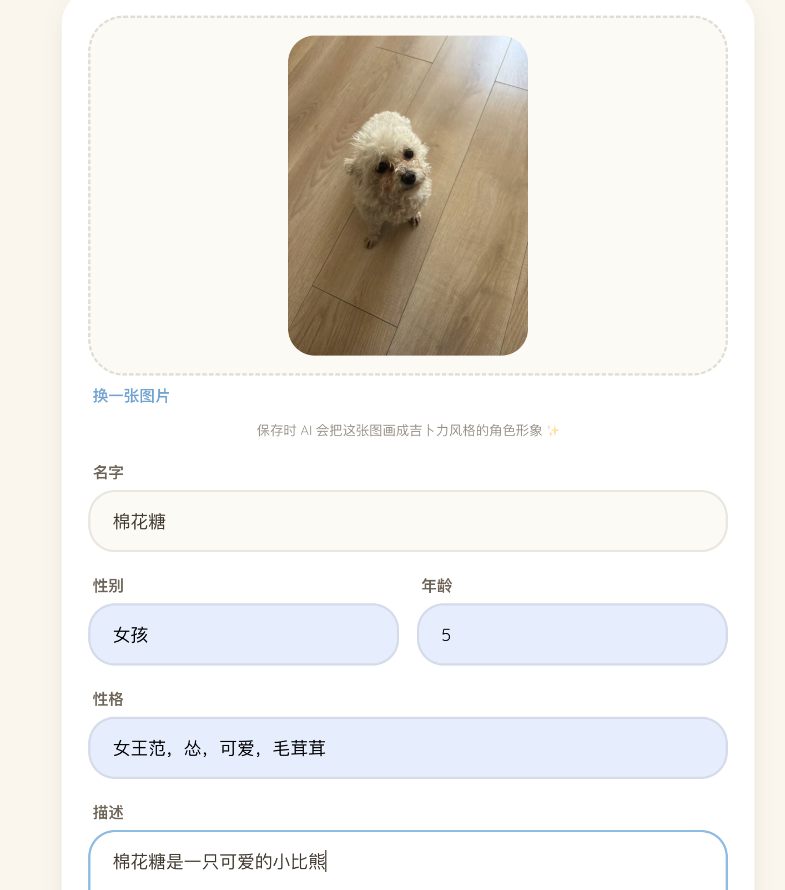
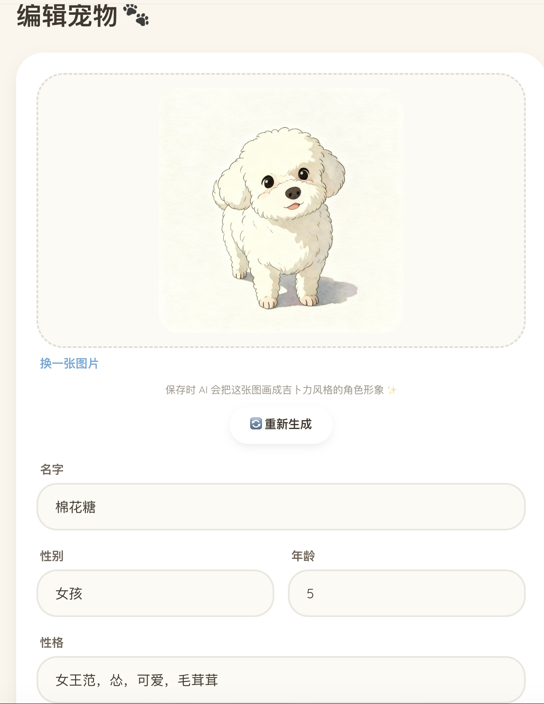
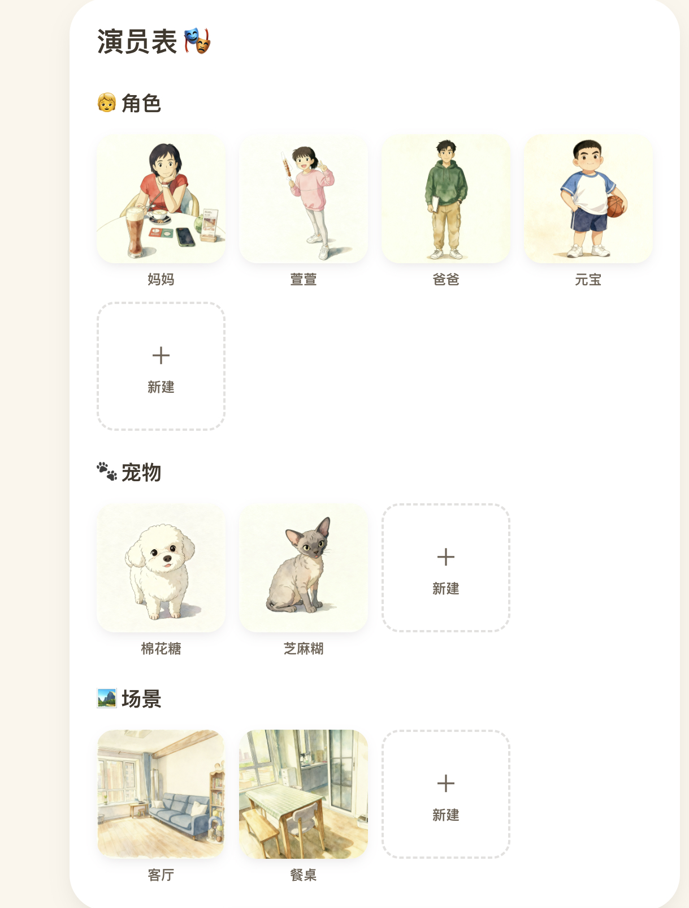
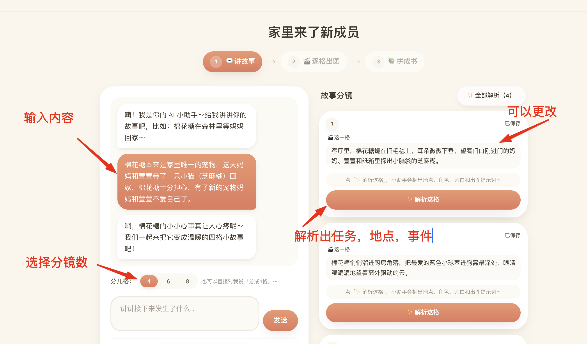
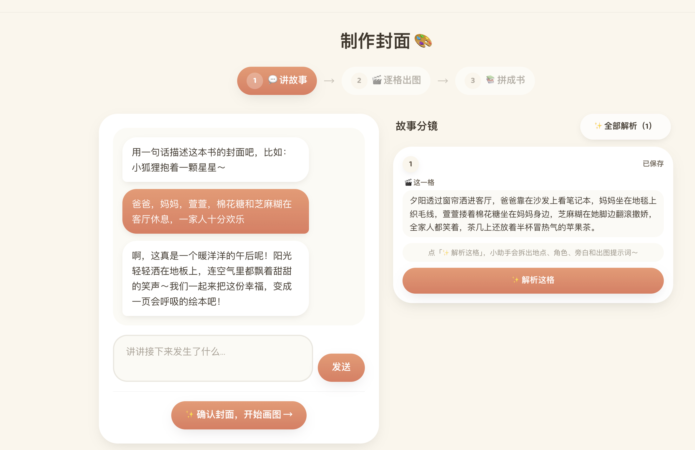
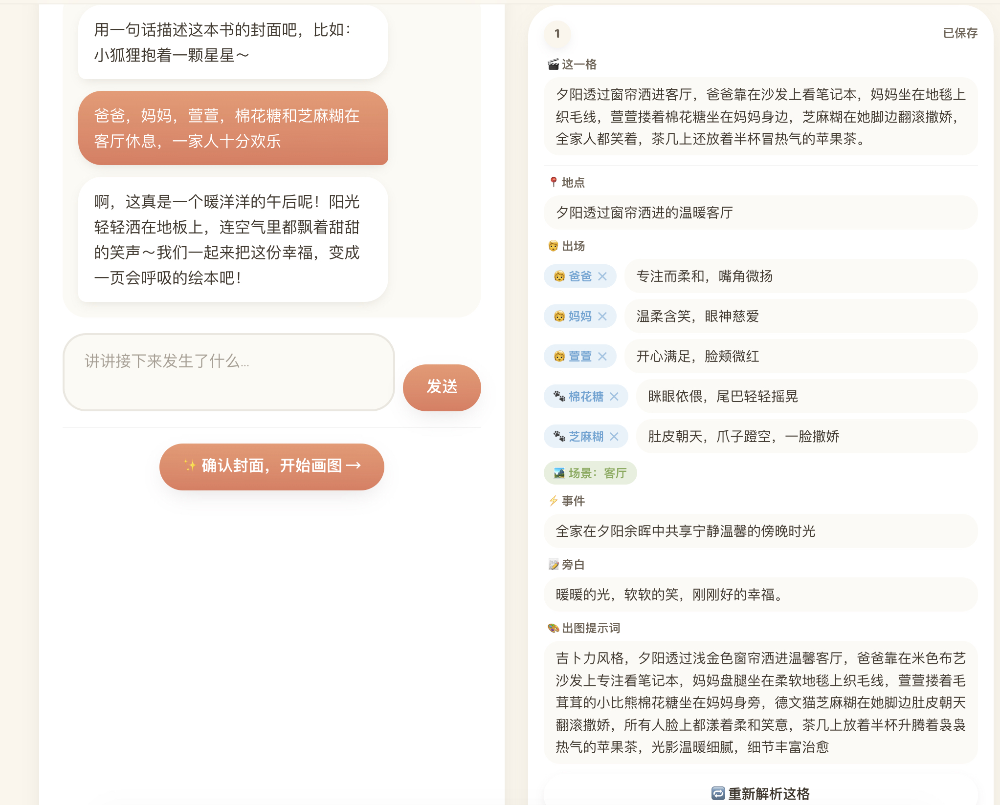

# oh-my-commic 使用文档 🎨📖

面向小朋友和家长的 AI 漫画书：上传家人/宠物的照片 → AI 画成吉卜力风格的固定角色 → 用对话把故事拆成一格格分镜 → 逐格出图 → 拼成一本可翻页的绘本，还能发布到社区给大家看。

> 本文按真实操作顺序走一遍。每一步都不需要懂技术，跟着点就行。

---

## 0. 登录与注册

- 打开站点首页，默认进入**社区**（未登录也能浏览、翻看别人公开的绘本）。
- 想创作自己的书，点左侧「📚 我的漫画」或右下角「登录 / 注册」。
- **注册需要邀请码**（防止被刷爆生图额度）：填 用户名 + 密码 + 邮箱 + **邀请码**。
  - 用户名：小写字母开头，只能小写字母/数字/下划线，3–20 位。
  - 密码：8–64 位，至少含 1 个字母 + 1 个数字。
  - 邀请码找管理员要（管理员登录后在「个人资料」里可查看/轮换）。
- 每个账号有**积分**（默认 100）：每次 AI 出图 / 把照片漫画化各扣 1 分，失败自动退还。顶栏/左栏能看到余额。

---

## 1. 新建一本书

进入「我的漫画」书架，点「＋ 创作新书」，给书起个名字即可（例如《我们家的一天》）。建好后进入这本书的工作台。

---

## 2. 建「演员表」：角色 / 宠物 / 场景

这是最关键的一步——先把这本书里会出现的**人、宠物、地点**都定下来，AI 会把它们画成**固定形象**，后面每一格都复用同一个样子，保证前后一致。

### 2.1 上传一张真实照片

在工作台点角色/宠物/场景的「＋ 新建」，上传一张照片，并填好设定：名字、性别、年龄、性格、一句描述。

> 保存时，AI 会把这张照片**重绘成吉卜力风格**的角色形象。

### 2.2 保存后自动漫画化成固定形象

保存后，真实照片被画成柔和的绘本风角色。不满意可以点「🔄 重新生成」再画一版，或「换一张图片」重新上传。

> 🔒 **隐私**：系统**不长期保存你上传的原始照片**（真人照更敏感）。「重新生成」是在**当前这张已漫画化的形象**上再画，不会回到原图。

### 2.3 把演员表凑齐

把这本书需要的角色、宠物、场景都建好，就有了一张完整的「演员表」。后面讲故事时，AI 就用这些固定形象来画每一格。

---

## 3. 讲故事，把它拆成一格格分镜

每一章（以及封面）都用**对话**来创作，分三步：**① 讲故事 → ② 逐格出图 → ③ 拼成书**（顶部有进度条）。

### 3.1 用大白话讲，AI 帮你拆镜

左边像聊天一样，用一两句话说这一章/封面发生了什么；AI 会温暖地回应，并在右边「故事分镜」里把它拆成一格格的基本内容。

- **选择分镜数**：4 / 6 / 8 格（也可以直接对 AI 说「分成 4 格」）。
- 右边每一格的文字**都可以直接改**。

封面同理——用一句话描述封面画面，确认后就能去画图：

### 3.2 逐格「解析」出结构化设定

对某一格点「✨ 解析这格」（或右上「全部解析」），AI 会把这格拆成：**地点、出场角色（各自的表情/神态）、场景、事件、旁白、出图提示词**。这些就是待会儿画图的依据，每一项都能手动微调，不满意可「🔁 重新解析这格」。

---

## 4. 逐格出图

切到第 ② 步「逐格出图」，对每一格点生成，AI 会结合这格的设定 + 演员表里的**固定形象参考图**画出画面（吉卜力风、无边框）。

- 想一次画完可以用「全部生成」，多格会**并发**出图。
- 每格可单独重画、微调设定后再出。

---

## 5. 拼成书 & 阅读

切到第 ③ 步「拼成书」，把画好的分镜拼成整本绘本；然后就能**翻页阅读**（封面大图 + 每章一页 + AI 写的温暖小结）。

---

## 6. 发布到社区

- 在「我的漫画」书架，每本书都有**「公开 / 私密」开关**。设为公开，这本书就出现在**社区**里，任何人（含未登录访客）都能翻看。
- 社区首页有**精选（最受喜欢的几本）**和**最新 / 最热**排序；别人可以给你的书**点赞**，也会记录**浏览量**。
- 随时可以改回私密下架。

---

## 常见问题

- **注册提示邀请码不对 / 注册不了？** 邀请码为空表示注册未开放；找管理员要当前邀请码（管理员在「个人资料」里能看/轮换）。
- **提示"邀请码名额已用完"？** 每个邀请码最多能邀请固定人数（默认 10 人），用满就会拒绝新注册。找管理员**轮换一个新邀请码**（名额会重置）再注册即可。管理员在「个人资料」的邀请码卡片上能看到「已用 X/上限」。
- **出图失败 / 提示画师忙？** 多为上游模型限流或超时，稍后重试；失败会自动退还积分。
- **角色前后长得不一样？** 确保在演员表里建好了固定形象，并且这一格「出场」里选对了对应角色——AI 按参考图还原。
- **分镜只出了 1 格？** 明确选好分镜数（4/6/8），或直接对 AI 说「分成 N 格」。
- **积分不够了？** 每次出图/漫画化扣 1 分；找管理员或按部署方的规则补充。

---

> 部署 / 本地运行见 [README](../README.md) 的「🚀 快速开始」与「🐳 Docker 部署」。
